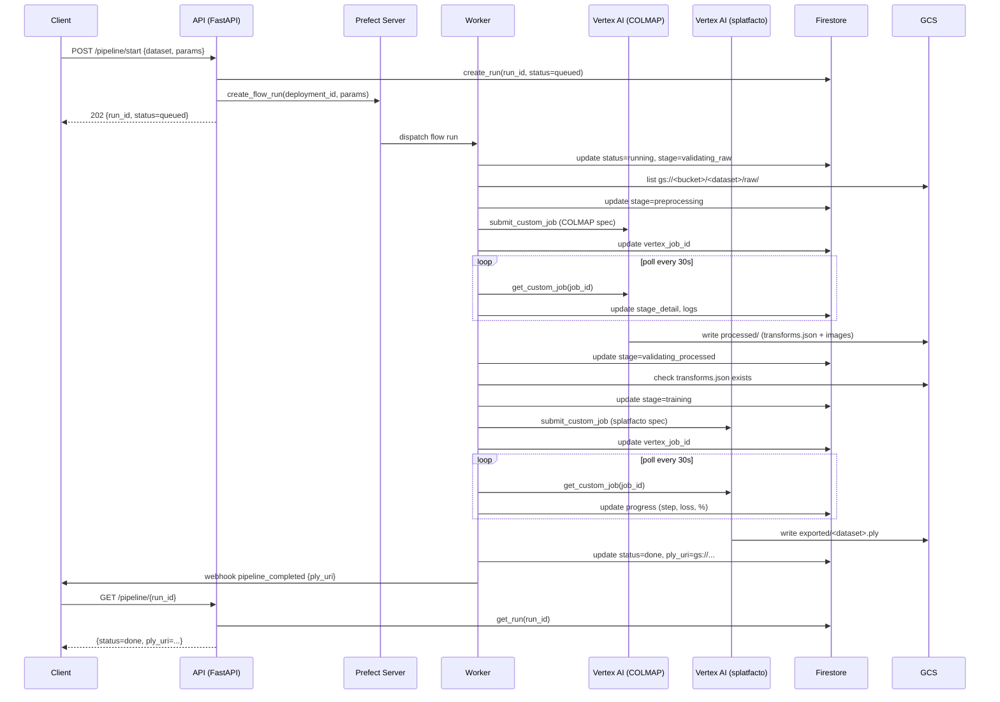
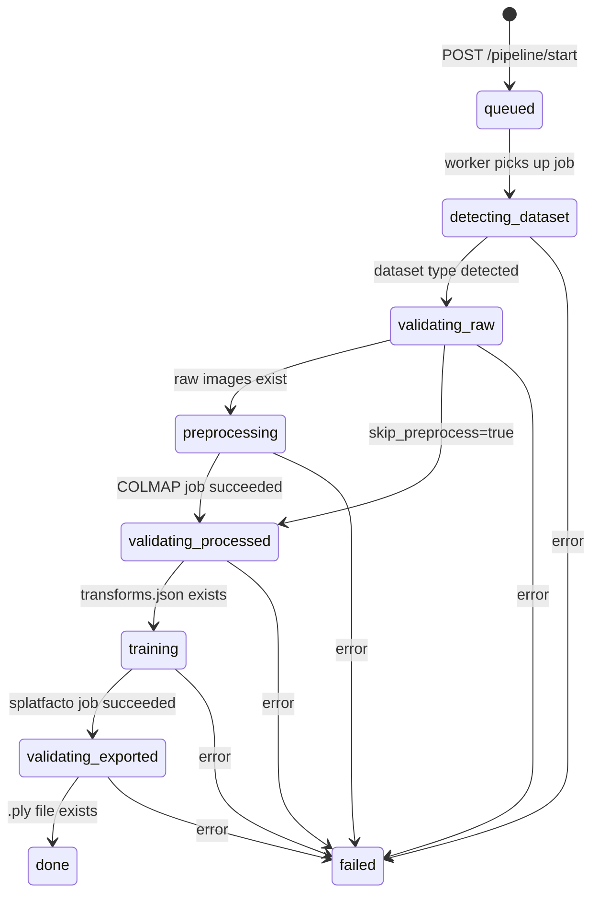
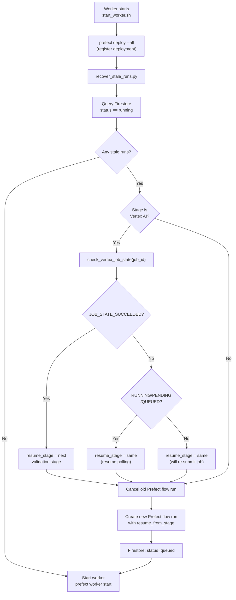

# Architecture — 3DaaS

## System Overview

3DaaS is a cloud pipeline that converts raw images into 3D Gaussian Splat files (`.ply`) using COLMAP + Nerfstudio splatfacto on Google Cloud, orchestrated with Prefect.

---

## High-Level Architecture

```mermaid
graph TD
    Client["Client\n(Laravel / curl)"]
    API["FastAPI Gateway\napi/main.py\n:8080"]
    Prefect["Prefect Server\n:4200"]
    Worker["Prefect Worker\nflows/pipeline.py"]
    Firestore["Firestore\npipeline_runs(_dev)"]
    GCS["GCS Bucket\nbucket-saas-project"]
    Vertex1["Vertex AI Job\nCOLMAP (CPU)\nn1-highmem-16"]
    Vertex2["Vertex AI Job\nsplatfacto (GPU L4)\ng2-standard-12"]
    Webhook["Webhook\n(Laravel callback)"]

    Client -->|POST /pipeline/start| API
    API -->|create flow run| Prefect
    API -->|write run doc| Firestore
    Prefect -->|dispatch job| Worker
    Worker -->|poll + update status| Firestore
    Worker -->|submit job| Vertex1
    Worker -->|submit job| Vertex2
    Vertex1 -->|write processed/| GCS
    Vertex2 -->|write exported/| GCS
    Worker -->|send events| Webhook
    Client -->|GET /pipeline/{id}| API
    API -->|read doc| Firestore
```

---

## Component Architecture

### GCE VM (vm-3daas)

All three services run on a single `e2-standard-2` VM via docker-compose:

```
┌─────────────────────────────────────────────────────────┐
│  GCE VM  vm-3daas  (us-central1-a, e2-standard-2)       │
│                                                         │
│  ┌──────────────────────┐  ┌──────────────────────────┐ │
│  │   prefect-server     │  │   api                    │ │
│  │   :4200              │  │   :8080                  │ │
│  │   prefecthq/prefect  │  │   Dockerfile.api         │ │
│  └─────────┬────────────┘  └────────────┬─────────────┘ │
│            │ healthcheck OK             │               │
│  ┌─────────▼────────────────────────────▼─────────────┐ │
│  │   prefect-worker                                    │ │
│  │   Dockerfile.worker                                 │ │
│  │   work pool: gcp-worker                             │ │
│  │   flows/ + api/ + utils/                            │ │
│  └─────────────────────────────────────────────────────┘ │
│                                                         │
│  Volumes:                                               │
│    ./logs/     → /app/logs  (shared across containers)  │
│    ./utils/    → /app/utils (hot reload utils module)   │
│    prefect-data → /root/.prefect                        │
└─────────────────────────────────────────────────────────┘
```

---

## Data Flow



---

## Module Map

```
flows/
├── pipeline.py        Main @flow — gaussian_pipeline()
│                      Resume logic, stage routing, Firestore updates
├── config.py          Environment config + PreprocessParams + TrainParams
└── tasks/
    ├── gcs.py         GCS validation tasks
    │   ├── detect_dataset_type()       → "raw" | "nerfstudio" | "blender" | "dnerf"
    │   ├── validate_raw_input()        → checks raw/ has images
    │   ├── validate_processed_output() → checks processed/transforms.json
    │   └── validate_exported_output()  → checks exported/*.ply
    ├── vertex.py      Vertex AI tasks
    │   ├── submit_preprocess_job()     → creates COLMAP Custom Job
    │   ├── submit_train_job()          → creates splatfacto Custom Job
    │   ├── poll_vertex_job()           → polls until done, parses logs
    │   ├── check_vertex_job_state()    → single state check (for recovery)
    │   └── build_job_resource_name()   → constructs full resource name
    └── notify.py      Webhook tasks
        └── send_webhook()              → POST to WEBHOOK_URL

api/
├── main.py            FastAPI endpoints
│   ├── POST /pipeline/start
│   ├── GET  /pipeline/{run_id}
│   ├── GET  /pipeline
│   ├── DELETE /pipeline/{run_id}
│   └── GET  /health
└── db.py              Firestore CRUD
    ├── create_run()
    ├── update_run()
    ├── get_run()
    ├── list_runs()
    └── delete_run()

utils/
└── logger.py          Centralized logging
    ├── setup_logging(component)   → configures root logger
    └── get_logger(name)           → returns named logger

scripts/
├── start_worker.sh          Worker container entrypoint
├── deploy_vm.sh             Deploy to GCE VM
├── sync_dataset.sh          Upload dataset to GCS
└── recover_stale_runs.py    Resume interrupted runs on startup
```

---

## State Machine

Pipeline runs follow a strict stage progression stored in Firestore:



---

## GCS Layout

```
gs://bucket-saas-project/
├── <dataset>/
│   ├── raw/                ← User uploads images here
│   │   ├── image001.jpg
│   │   ├── image002.jpg
│   │   └── ...
│   ├── processed/          ← COLMAP output (written by Vertex AI Stage 1)
│   │   ├── transforms.json
│   │   └── images/
│   │       └── *.jpg
│   ├── trained/            ← Nerfstudio checkpoints (written by Vertex AI Stage 2)
│   │   └── splatfacto/
│   │       └── ...
│   ├── exported/           ← Final .ply file (written by Vertex AI Stage 2)
│   │   └── <dataset>.ply
│   └── data/               ← Pre-processed datasets (dnerf, blender, nerfstudio)
│       └── ...
```

---

## Vertex AI Job Specs

### Stage 1 — COLMAP (preprocessing)

Spec file: [specs/preprocess_spec.json](../specs/preprocess_spec.json)

| Parameter | Value |
|---|---|
| Machine type | `n1-highmem-16` |
| Accelerator | None (CPU only) |
| Image | `image-preprocess:v2` |
| Command | `ns-process-data images` + `gcloud storage cp` |
| Estimated runtime | 5–30 min depending on image count |

### Stage 2 — splatfacto (training + export)

Spec file: [specs/train-export-spec.json](../specs/train-export-spec.json)

| Parameter | Value |
|---|---|
| Machine type | `g2-standard-12` |
| Accelerator | 1× NVIDIA L4 |
| Image | `image-train-l4:v1` |
| Command | `ns-train splatfacto` + `ns-export gaussian-splat` + upload |
| Estimated runtime | 20–60 min depending on iterations |

---

## Firestore Schema

Collection: `pipeline_runs` (production) / `pipeline_runs_dev` (local)

```json
{
  "run_id":              "550e8400-e29b-41d4-a716-446655440000",
  "dataset":             "mi_escena",
  "status":              "running",
  "stage":               "training",
  "started_at":          "2026-03-10T12:00:00Z",
  "completed_at":        null,
  "ply_uri":             null,
  "error":               null,
  "prefect_flow_run_id": "abc123",
  "vertex_job_id":       "projects/.../locations/.../customJobs/456",
  "dataset_type":        "raw",
  "image_count":         150,
  "params": {
    "matching_method":         "vocab_tree",
    "sfm_tool":                "colmap",
    "feature_type":            "sift",
    "matcher_type":            "NN",
    "num_downscales_preprocess": 3,
    "skip_colmap":             false,
    "skip_preprocess":         false,
    "dataparser":              "nerfstudio",
    "max_iters":               30000,
    "sh_degree":               3,
    "num_random":              100000
  },
  "progress": {
    "step":    15000,
    "loss":    0.042,
    "pct":     50,
    "wandb_url": "https://wandb.ai/..."
  },
  "recent_logs": ["line 1", "line 2", "..."]
}
```

---

## Environment Isolation

| Variable | `local` | `production` |
|---|---|---|
| `APP_ENV` | `local` | `production` |
| Firestore collection | `pipeline_runs_dev` | `pipeline_runs` |
| Log level (console) | `DEBUG` | `INFO` |
| Log files | app.log + error.log + debug.log | app.log + error.log |

Switching between environments only requires changing `APP_ENV` in `.env`.

---

## Crash Recovery

When the Prefect worker restarts (crash, deploy, OOM), `recover_stale_runs.py` runs automatically before the worker starts accepting new jobs:


